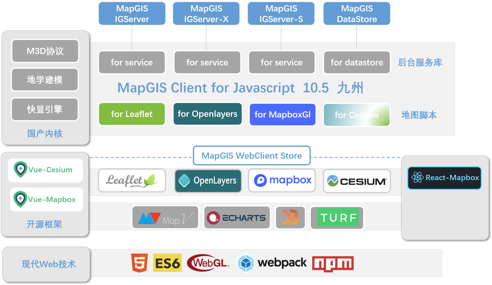
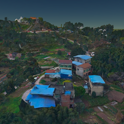
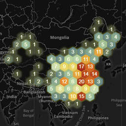
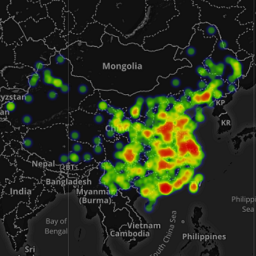
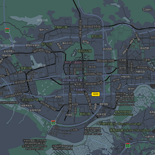

# MapGIS Client for JavaScript

[![npm version][npm-img]][npm-url]
[](https://github.com/MapGIS/WebClient-JavaScript/blob/master/LICENSE)

[npm-img]: https://img.shields.io/badge/npm-10.5.0-brightgreen
[npm-url]: https://www.npmjs.com/package/@mapgis/webclient

MapGIS Client for JavaScript：是增强的MapGIS Web开发平台，集成Openlayers、Leaflet、MapBox、Cesium等框架，ECharts、MapV、D3等可视化库，在传统WebGIS开发基础之上，增强大数据、实时流数据的高效可视化表达和分析，为用户带来全新开发体验。



## 目录

- [MapGIS Client for JavaScript](#mapgis-client-for-javascript)
  - [目录](#目录)
  - [一、开始](#一开始)
    - [1、司马云](#1司马云)
    - [2、GitHub](#2github)
    - [3、特性](#3特性)
    - [4、示例](#4示例)
  - [二、深入了解](#二深入了解)
    - [1、代码结构](#1代码结构)
    - [2、运行示例网站](#2运行示例网站)
    - [3、编译](#3编译)
    - [3、问题](#3问题)
    - [4、依赖](#4依赖)
  - [三、资源](#三资源)
    - [Npm](#npm)
    - [1、在线资源](#1在线资源)
    - [2、在线服务](#2在线服务)
    - [四、团队](#四团队)
    - [五、证书](#五证书)

## 一、开始

### 1、司马云
[MapGIS Client for JavaScript](http://develop.smaryun.com:8899/)

> 本脚本所有的示例都在对应的演示站点有详细的说明教程

### 2、GitHub
1. GitHub是初始模板，物理上整合了leaflet,mapboxgl,cesium,openlayers, zondyclient等多个脚本，仅做技术验证&选型
2. 司马云在逻辑上重构设计webclient-javascript，整合统一igserver,datastore,d3,mapv,echarts主流开源技术，基础平台长期维护
3. 更多详情请查看司马云 www.smaryun.com

### 3、特性
| 四大地图引擎                                                         | 融合热门前端可视化技术                                               | 多样化开发方式                                                       |
| :------------------------------------------------------------------- | :------------------------------------------------------------------- | :------------------------------------------------------------------- |
|  |  |  |

### 4、示例
<p align="center">
    <a href="">
        
    </a>&nbsp;
    <a href="">
        
    </a>&nbsp;    
    <a href="">
        
    </a>&nbsp;    
    <a href="">
        
    </a>&nbsp;    
</p>
<p align="center">
    <a href="">
        
    </a>&nbsp;
    <a href="">
        
    </a>&nbsp;    
    <a href="">
        
    </a>&nbsp;    
    <a href="">
        
    </a>&nbsp;    
</p>
<p align="center">
    <a href="">
        
    </a>&nbsp;
    <a href="">
        
    </a>&nbsp;    
    <a href="">
        
    </a>&nbsp;    
    <a href="">
        
    </a>&nbsp;    
</p>

## 二、深入了解
### 1、代码结构
``` text
 |-- WebClient-JavaSript
   |-- docs                         -- JsDoc文档生成模块
      |-- cdn                       -- 模块依赖离线cdn
      |-- jsdoc-config              -- JsDoc的四大地图脚本的配置格式
      |-- templates                 -- JsDoc的内置模板
   |-- src                          -- sdk
      |-- cesiumjs                  -- cesium的代码结构
      |-- common                    -- 封装通用的基本类以及抽象类
      |-- config                    -- webpack 打包脚本
      |-- leaflet                   -- leaflet 代码结构
      |-- mapboxgl                  -- mapboxgl 代码结构
      |-- openlayers                -- openlayers 代码结构
      |-- service                   -- 封装igserver服务
   |-- website                      -- 示例网站
      |-- express                   -- node服务，在一些wind2003等老机器上替代IIS
      |-- public                    -- 网页的公共路径
      |-- src                       -- 示例网页的vue代码
```

### 2、运行示例网站

1. 进入示例网站对应的目录

    ``` sh
    cd website
    ```

2. 安装依赖

    ``` sh
    npm install
    ```

3. 运行网页

    ``` sh
    npm start
    ```  

### 3、编译

如果您需修改源码，可自行编译打包生成OpenLayers、Leaflet、MapBoxGL、Cesium的地图引擎库、API文档。

1. 安装依赖
    ``` sh
    npm install
    ```

2. 地图引擎编译
    ``` sh
    npm run mapbox-debug           #编译调式版本 服务与开源地图脚本一起编译打包
    npm run mapbox-release         #编译生产版本 服务与开源地图脚本一起编译打包
    npm run mapbox-plugin-debug    #编译调式版本 服务与开源地图脚本独立编译打包
    npm run mapbox-plugin-release  #编译生产版本 服务与开源地图脚本独立编译打包
    ```

3. 单独服务编译
    ``` sh
    npm run service-debug          #单独编译服务调试版本
    npm run service-release        #单独编译服务生产版本
    ```

4. API文档生成
    ``` sh
    build-docs-leaflet             #生成API参考文档
    ```

### 3、问题

* [判断多边形自相交?](https://github.com/MapGIS/WebClient-JavaScript/issues/18)
* [后台空间分析出错误?](https://github.com/MapGIS/WebClient-JavaScript/issues/5)

### 4、依赖

* leaflet [1.0+ ~ 1.5.1-](https://leafletjs.com/2019/05/08/leaflet-1.5.1.html) ([CDN链接](https://unpkg.com/leaflet@1.5.1/dist/leaflet.js))
  *  [Leaflet](http://leafletjs.com) version 1.0以上 1.5.1以下
* openlayer [5.0+](https://openlayers.org/) ([CDN链接](https://cdn.rawgit.com/openlayers/openlayers.github.io/master/en/v5.3.0/build/ol.js))
  *  [OpenLayers](https://openlayers.org/) version 5.0+
* mapboxgl [1.9+]() ([CDN链接](https://www.npmjs.com/package/@mapgis/mapbox-gl))
  *  [MapboxGL](https://www.npmjs.com/package/@mapgis/mapbox-gl) version 1.9+
* cesium 
  *  [mapgis司马云pro版本-cesium]()

## 三、资源

### Npm
1. 原始地图引擎  (npm上直接获取)
    1. @mapgis/cesium
    1. @mapgis/mapbox-gl
    1. leaflet 1.7.0+
    1. ol 5+ 暂不支持6的版本
2. MapGIS拓展插件 (npm上无法直接获取)
    1. webclient-cesium-plugin  (内置了webclient-es6-service)
    2. webclient-mapboxgl-plugin  (内置了webclient-es6-service)
    3. webclient-leaflet-plugin  (内置了webclient-es6-service)
    4. webclient-openlayers-plugin  (内置了webclient-es6-service)
    5. webclient-es6-service   (针对纯RestfulAPI，不带地图视图)
3. Vue组件 (npm上直接获取)
   1. @mapgis/webclient-vue-cesium
   2. @mapgis/webclient-vue-mapboxgl
   3. @mapgis/webclient-es6-service

### 1、在线资源
[资源中心-云开发世界](http://www.smaryun.com/dev/resource_center.html#/type27/tag184/page1)

### 2、在线服务
[问答社区-云听](http://www.smaryun.com/cloudlisten/index.php)

### 四、团队

* 协议格式
  * `M3D` [M3D三维部门]()
* 服务
  * `service` [IGServer]()
  * `DataStore` [DataStore]()
* 前端  
  * `技术支持` [技术支持部]()

### 五、证书

Copyright &copy; 2020-2024 MapGIS

Licensed under the Apache License, Version 2.0 (the "License");
you may not use this file except in compliance with the License.
You may obtain a copy of the License at

> http://www.apache.org/licenses/LICENSE-2.0

Unless required by applicable law or agreed to in writing, software
distributed under the License is distributed on an "AS IS" BASIS,
WITHOUT WARRANTIES OR CONDITIONS OF ANY KIND, either express or implied.
See the License for the specific language governing permissions and
limitations under the License.

A copy of the license is available in the repository's [LICENSE](./LICENSE) file.


