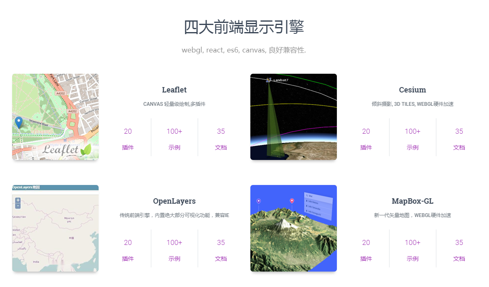
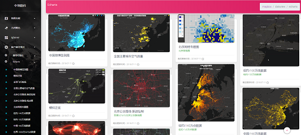
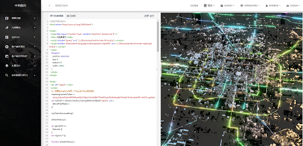

# WebClient-JavaScript
中地数码WebClient官方演示网站  [WebClient-JavaScript](http:/client.snanyun.com:8899/ui/index.html)

> 一套集成四大开源显示引擎的现代地图可视化脚本
> 1. Leaflet
> 1. MapBox GL
> 1. Cesium
> 1. OpenLayers

## 热门开源可视化技术Echart ,MapV, d3

## 分布式大数据空间分析,时空立方体等可视化表达

## ElasticSearch实时搜索

# 示例 & Simple

  

