# Webclient 示例站点部署手册

## 部署过程说明

1. 将dist中的内容放入site\static\libs下。

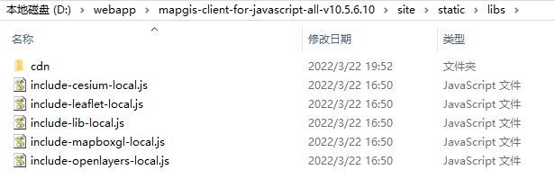

																														
图1

2. 使用IIS或nginx发布整个site文件夹，建议使用nginx，如果使用IIS请注意使用包中附带的web.config文件。  

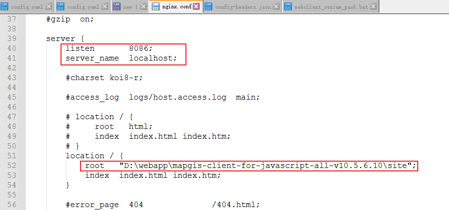

																										
图2 ngix中配置示例站点演示

3. 配置相关文档

   3.1 将包中site/docs目录下vue-cesium、vue-mapboxgl、vue-ui 3个文件夹各自单独发布为一个站点，记录三个站点的IP和端口号。

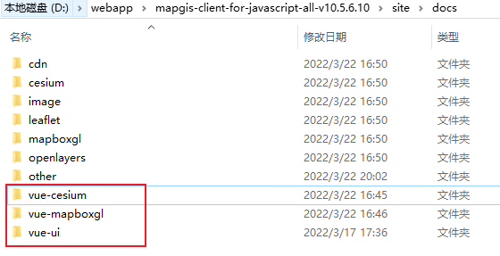

																																	
图3

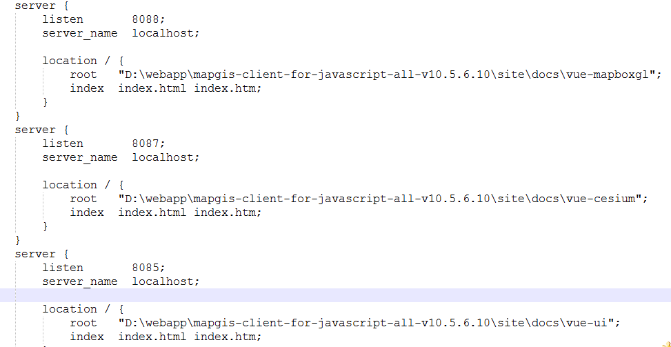

图4 nginx中3个文档站点的配置示例

​	3.2 在site/static/demo/config目录下编辑config-headers.json文件，找到如图5所示位置，将3个站点的IP和端口信息按links中的顺序在文件对应位置填写正确：

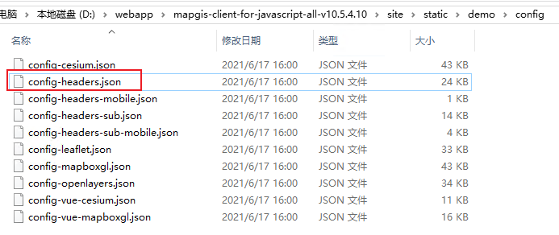

图5
																				

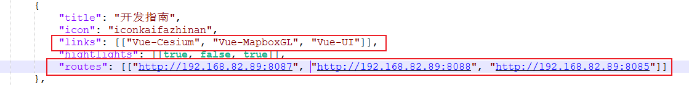

图6
										

​				保证示例站点中以下3个链接可以正确访问到

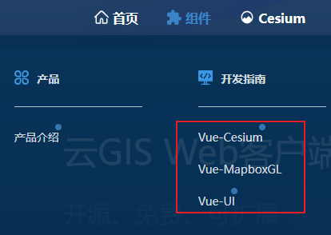

图7

4. 配置新版cesium沙盒示例

   4.1 按上述第3步将包中site\cesium-sandcastle文件夹发布成单独站点并在site/static/demo/config目录下config-headers.json文件中进行对应链接的配置

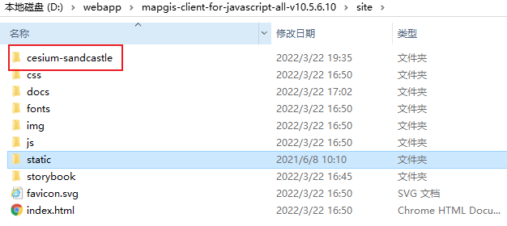

图8

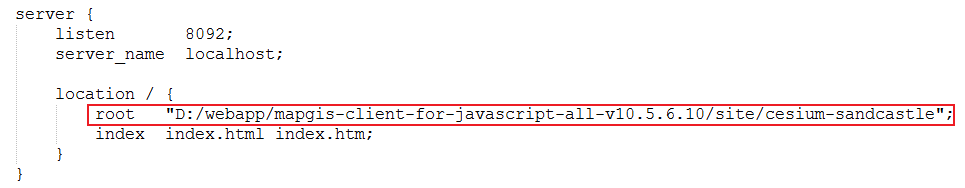

图9 ngix配置文件配置沙盒站点

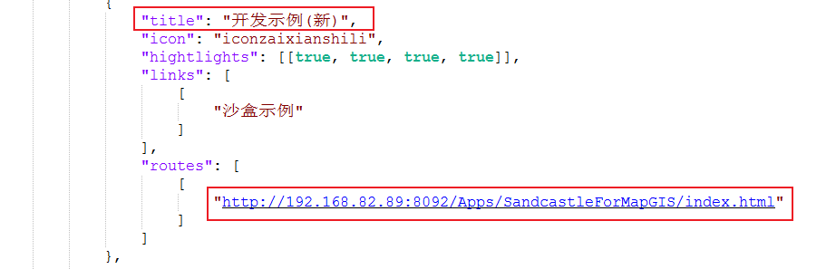

图10 config-headers.json文件中配置沙盒站点链接

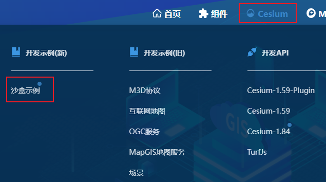

图11 配置后的界面效果

