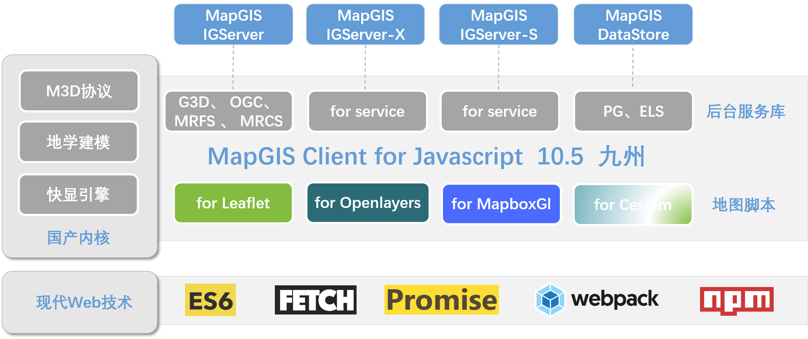

# MapGIS Client for JavaScript - Service

[![npm version][npm-img]][npm-url]
[](https://github.com/MapGIS/WebClient-JavaScript/blob/master/LICENSE)

[npm-img]: https://img.shields.io/badge/npm-10.5.5-brightgreen
[npm-url]: https://www.npmjs.com/package/@mapgis/webclient

MapGIS Client for JavaScript - Service：是增强的MapGIS Web开发平台，集成Fetch、ES6、Promise等现代特性，在传统WebGIS开发基础之上，增强大数据、实时流数据的高效可视化表达和分析，为用户带来全新开发体验。



[在线文档](http://develop.smaryun.com/docs/mapboxgl/index.html)

## 环境
> 由于core-js2和core-js3的在vue-cli4的不同的前置依赖导致了在vue2的环境下core-js不能把对应的依赖版本加入到package.json中，但是实际上package.json中引用的是core-js3的版本，一旦显示的描述会导致所有引用webclient-vue-ui的库的库都会强行自动升级core-js3，导致整个环境冲突问题。这个问题只能通过升级vue3来解决。
## 目录
针对MapGIS提供的IGServer/IGServer-X/IGServer-S/DataStore/ArcGIS等多种服务进行封装
``` js
{
    Style,
    Crs,
    Common,
    BaseServer,
    // igserver
    Extend,
    G3D,
    MRCS,
    MRFS,
    MRFWS,
    MRGS,
    MRMS,
    Info,
    OGC,
    // datastore
    ElasticSearch,
    PostGIS,
    CloudDisk,
    // arcgis
    ArcGis
}; 
```

## 使用
``` js
import { Style } from "@mapgis/webclient-es6-service";
const { MarkerStyle, LineStyle, PointStyle, FillStyle } = Style;

let layerStyle = new PointStyle({
    radius: 12,
    color: "#ffffff",
    opacity: 0.8,
    outlineWidth: 5,
    outlineColor: "#52B883",
});
```

## 调试
> 默认的引入方式是main
``` json
{
    "main": "dist-libs/webclient-es6-service.min.js",
    "module1": "index.js",
}
```
> 如果需要试试调试请修改成如下:
``` json
{
    "main1": "dist-libs/webclient-es6-service.min.js",
    "module": "index.js",
}
``` 
> 同时安装对应的所需依赖
``` sh
# 使用yarn
yarn 
# 或者使用npm
npm install 
```