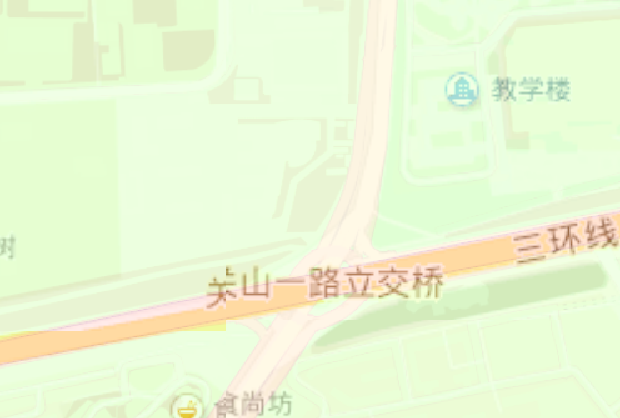

# 原理

国内的图商数据都强制要求数据加密一次火星坐标系 (GCJ-02) ,因此整个地图是产生了偏移。

## 核心原理

1. 通过 **反解析** 火星坐标系 (GCJ-02) 得到 **WGS84（CGCS2000椭球）无偏数据**
2. 然后根据无偏数据在Cesium的切分模型上进行对应的**纠偏校正处理**
3.  

## 高德

高德相对简单就是基于墨卡托投影的前提下进行简单的位置纠偏


| 纠偏前                         | 纠偏后                        |
| ------------------------------ | ----------------------------- |
|  |  |

## 百度

分2类：WGS84椭球纠偏和 BD09坐标系的偏移

``` js
this._crs = options.crs || 'BD09';
    if (options.crs === 'WGS84') {
        var resolutions = [];
        for (var i = 0; i < 19; i++) {
            resolutions[i] = 256 * Math.pow(2, 18 - i);
        }
        this._tilingScheme = new BaiduTilingScheme({
            resolutions: resolutions,
            rectangleSouthwestInMeters: new Cartesian2(-20037726.37, -12474104.17),
            rectangleNortheastInMeters: new Cartesian2(20037726.37, 12474104.17)
        });
    } else {
        this._tilingScheme = new WebMercatorTilingScheme({
            rectangleSouthwestInMeters: new Cartesian2(-33554054, -33746824),
            rectangleNortheastInMeters: new Cartesian2(33554054, 33746824)
        });
    }
```


### BD09坐标系

原理和高德纠偏几乎一致 


### WGS84坐标系

基于百度独特的**最后一级256像素**的分辨率机制进行对应的计算

| 级别 | 分辨率    resolutions =  256 * Math.pow(2, 18 - level) |
| ---- | ------------------------------------------------------ |
| 0    | 33554432                                               |
| 1    | 16777216                                               |
| 2    | 8388608                                                |
| 3    | 4194304                                                |
| 4    | 2097152                                                |
| 5    | 1048576                                                |
| 6    | 524288                                                 |
| 7    | 262144                                                 |
| 8    | 131072                                                 |
| 9    | 65536                                                  |
| 10   | 32768                                                  |
| 11   | 16384                                                  |
| 12   | 8192                                                   |
| 13   | 4096                                                   |
| 14   | 2048                                                   |
| 15   | 1024                                                   |
| 16   | 512                                                    |
| 17   | 256                                                    |

上面的表格对应百度独特的切分模型经纬网，需要建立一个百度特有的网格切分模型**BaiduTilingScheme**

| 纠偏前                         | 纠偏后                        |
| ------------------------------ | ----------------------------- |
|  |  |


## 任意投影 + 瓦片切分规则

**已实现，不公开原理**