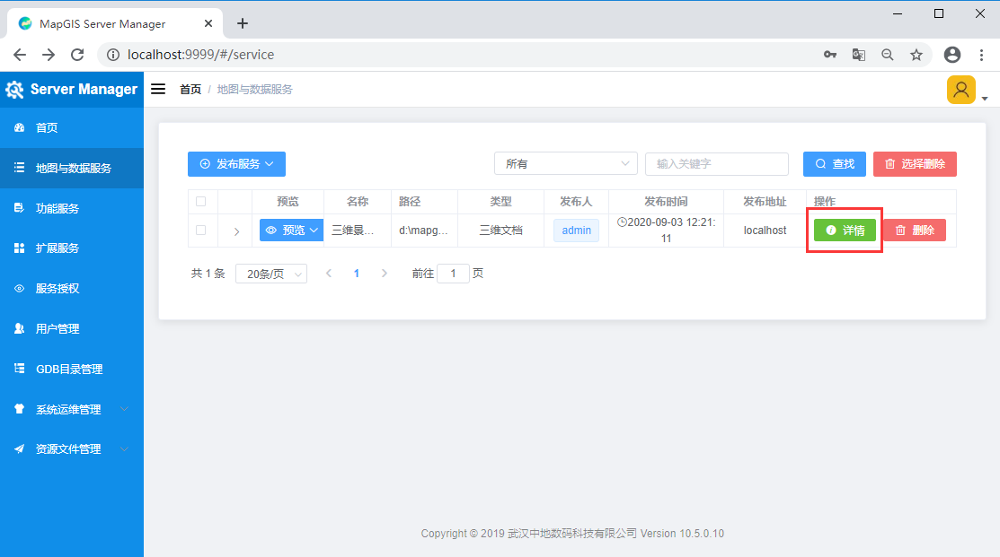

## 准备开发

&ensp;&ensp;&ensp;&ensp;进行WebGIS应用开发，一般均采用前端开发库+GIS服务的模式，开发者须完成如下三个步骤：

&ensp;&ensp;&ensp;&ensp;**第一步：<font color=red>安装配置开发环境</font>，包括MapGIS开发环境（含开发授权）、集成开发环境；**

&ensp;&ensp;&ensp;&ensp;根据实际应用需求，选择.NET或九州系列MapGIS开发平台产品安装，通常包括MapGIS Desktop桌面工具、MapGIS IGServer等云GIS产品。

&ensp;&ensp;&ensp;&ensp;例如选用.NET版本，常用环境如下：
- MapGIS开发包：<a href="http://smaryun.com/dev/download_detail.html#/download689" targer="_blank">MapGIS IGServer .NET x64 for Windows开发包</a>
- MapGIS开发授权：<a href="http://www.smaryun.com/dev/dev_auth_detail.php" targer="_blank">云开发授权</a>（基础版/高级版）
- 集成开发环境：Visual Studio Code

&ensp;&ensp;&ensp;&ensp;**第二步：<font color=red>发布GIS服务资源</font>，在MapGIS IGServer的服务管理器中发布所需的地图服务，以及扩展的功能服务等；**

&ensp;&ensp;&ensp;&ensp;基于MapGIS Server Manager发布地图服务的具体操作，请查看**MapGIS IGServer操作手册**（<a href="http://www.smaryun.com/dev/resource_center.html#/type27/tag206/page1/doc770" target="_blank">.NET版</a>，<a href="http://www.smaryun.com/dev/resource_center.html#/type27/tag212/page1/doc823" target="_blank">九州版</a>）

&ensp;&ensp;&ensp;&ensp;在访问MapGIS IGServer的服务时，需要先确定GIS服务器IP地址与服务端口号；在二次开发时，根据所使用的MapGIS IGServer平台版本以及其服务管理器中IGServer配置情况（ip、port），对二次开发接口中涉及的地图服务访问的ip、port进行相应设置。

- .NET版：IGServer服务管理器访问默认地址（127.0.0.1:9999）、IGServer服务访问默认基地址（127.0.0.1:6163）
- 九州版：IGServer服务管理器访问默认地址（127.0.0.1:8089）、IGServer服务访问默认基地址（127.0.0.1:8089）
  
&ensp;&ensp;&ensp;&ensp;**第三步：<font color=red>获取前端开发库（MapGIS Client for JavaScript开发库）</font>**，通过文件拷贝或npm方式引用开发库，进行WebGIS二维或三维应用开发。

- MapGIS官方下载地址：<a href="http://smaryun.com/dev/download_detail.html#/download828" targer="_blank">http://smaryun.com/dev/download_detail.html#/download828</a>
- GitHub 托管地址：<a href="https://github.com/MapGIS/WebClient-JavaScript" targer="_blank">https://github.com/MapGIS/WebClient-JavaScript</a>
- Gitee 托管地址：<a href="https://gitee.com/osmapgis/WebClient-JavaScript" targer="_blank">https://gitee.com/osmapgis/WebClient-JavaScript</a>

### 引入开发库


#### 文件方式（离线）

&ensp;&ensp;&ensp;&ensp;请下载MapGIS Client for JavaScript开发包，将开发库目录libs下的cdn文件夹与include-xx.js文件放在工程同一目录下，然后在网页中引入对应的include-xx.js文件即可，可以将整个目录[..\static\libs]拷贝到工程中

> 离线版本的核心原理就是根据include=""中的名字，在当前cdn文件夹下寻找对应的js的脚本并按照规定的顺序引入到浏览器中
> “include-*.js 通过include="xxx"的方式自动寻找引入对应的第三方脚本”

&ensp;&ensp;&ensp;&ensp;新建一个 HTML 文件，在 <head> 标签中引入 MapGIS Client for JavaScript（Cesium）的开发库：

- Example:

  ```javascript
  <script src="libs/include-cesium-local.js"></script>
  ```


#### nmp方式（在线）


## 开始开发

&ensp;&ensp;&ensp;&ensp;先根据“开发环境”要求安装配置好MapGIS开发环境（含MapGIS云开发授权），然后获取MapGIS Client for JavaScript（Cesium）SDK进行二次开发。

&ensp;&ensp;&ensp;&ensp;下面使用H5原生JS方式，演示如何在网页中加载显示一个M3D缓存模型数据（大雁塔）。

### 数据准备

&ensp;&ensp;&ensp;&ensp;本示例使用MapGIS官方云端（develop.smaryun.com）已经发布的名称为“DaYanTa”的M3D数据服务进行演示。若您需要显示自己的数据，需要在开发前进行数据处理，如创建/附加地理数据库、导入数据、生成M3D缓存数据等，最后通过**MapGIS Server Manager**配置GIS服务环境并发布三维地图服务。

<center>
  
  <br>
  <div class="notes">MapGIS Server Manager发布服务</div>
</center>
<br/>

> 基于MapGIS Server Manager发布地图服务的具体操作，请查看**MapGIS IGServer操作手册**（<a href="http://www.smaryun.com/dev/resource_center.html#/type27/tag206/page1/doc770" target="_blank">.NET版</a>，<a href="http://www.smaryun.com/dev/resource_center.html#/type27/tag212/page1/doc823" target="_blank">九州版</a>）

### 开发入门：加载M3D模型数据

> 本示例使用的开发集成工具为 Visual Studio Code（简称VSCode），您可以根据开发习惯选择适合自己的开发工具

#### Step 1. 新建Web网站

&ensp;&ensp;&ensp;&ensp;在VSCode或本地磁盘中新建一个文件目录作为Web网站目录，名称为SceneDisplay；

<center>
  
  <br>
  <div class="notes">新建网站目录</div>
</center>
<br/>

#### Step 2. 引入JavaScript开发库（离线方式）

&ensp;&ensp;&ensp;&ensp;在新建的Web网站（文件目录）中，拷贝MapGIS Client for JavaScript开发库到网站根目录下，即将SDK包路径MapGIS Client for JavaScript_V10.5.X.X\static\libs的libs拷贝到“SceneDisplay”目录下。此libs包含了全部的开发库（js与css文件），可选择只拷贝cesium的库。

<center>
  
  <br>
  <div class="notes">引入脚本库资源</div>
</center>
<br/>

#### Step 3. 加载显示M3D模型

(1) 在上述新建的网站中，通过新建文件方式，创建一个名称为“SceneM3DDisplay”的html网页文件，可通过自定义模板快速创建网页结构内容；

<center>
  
  <br>
  <div class="notes">新建HTML页面（空）</div>
</center>
<br/>

<center>
  
  <br>
  <div class="notes">新建HTML页面（模板）</div>
</center>
<br/>

(2) 设置示例标题，在该页面引入for WebGL开发的必要脚本库include-cesium-local.js，此脚本库会动态引入核心库webclient-cesium-plugin.min.js等与相关第三方库、样式文件等

<center>
  
  <br>
  <div class="notes">引用开发库</div>
</center>
<br/>


(3) 创建一个ID为“GlobeView”的div层，并设置其样式，用来作为显示矢量地图文档的地图容器;

<center>
  
  <br>
  <div class="notes">创建div层并设置样式</div>
</center>
<br/>

(4) 通过body的onload事件触发调用M3D模型缓存数据显示的脚本函数init()；

<center>
  
  <br>
  <div class="notes">body的onload事件</div>
</center>
<br/>

(5) 在该页面中嵌入JavaScript代码，实现加载M3D缓存模型的脚本函数init()，即初始化三维场景视图Cesium.WebSceneControl类，然后构造M3D模型层管理对象CesiumZondy.Layer.M3DLayer类对象，再通过此图层对象的append()方法加载三维地图文档，并自动跳转到数据位置；

> 注意：通常情况下，功能实现的JavaScript代码可以单独放置到一个JS文件中，便于维护

<center>
  
  <br>
  <div class="notes">加载M3D缓存模型的脚本函数init()</div>
</center>

- Example:

  ```javascript
        //在JS脚本开发中使用严格模式，及时捕获一些可能导致编程错误的ECMAScript行为
        'use strict';
        //定义三维场景控件对象
        var webGlobe;
        //定义M3D图层对象
        var obliqueLayerArr;
        //加载三维场景
        function init() {
            //构造三维视图对象（视图容器div的id，三维视图设置参数）
            webGlobe = new Cesium.WebSceneControl('GlobeView', {});

            //构造M3D模型层管理对象（视图）
            var m3dLayer = new CesiumZondy.Layer.M3DLayer({
                viewer: webGlobe.viewer
            });
            //加载M3D地图文档（服务地址，配置参数）
            obliqueLayerArr = m3dLayer.append(
                `http://develop.smaryun.com:6163/igs/rest/g3d/DaYanTa`, 
                {
                    autoReset: true //允许自动定位
                }
            );
        }
  ```

&ensp;&ensp;&ensp;&ensp;实现M3D模型缓存的加载显示过程如下：

&ensp;&ensp;&ensp;&ensp;（1）首先需要创建三维场景视图对象。三维场景控件构造函数如下：

&ensp;&ensp;&ensp;&ensp;**WebSceneControl(elementId, options)**

&ensp;&ensp;&ensp;&ensp;*参数说明：*

-	elementId：（ string类型）可选项，三维视图容器div的id。
-	options：（Object类型）可选项，MapGIS三维场景初始化相关参数，以键值对的形式设置，主要参数如下：

| 参数名 |	类 型 |	默认值 |	说 明 |
| ------ | ------|------|------|
|viewerMode	|String	|‘3D’	|（可选）初始视图模式默认为三维球视图 '2D’表示二维视图 ‘COLUMBUS_VIEW’ 表示三维平面视图|
|showInfo	|Boolean|	false	|（可选）是否显示默认的属性信息框
|animation|	Boolean| true|	（可选）默认动画控制不显示|
|baseLayerPicker|	Boolean|	true|	（可选）是否创建图层控制显示小组件|
|fullscreenButton	|Boolean	|true	|（可选）是否创建全屏控制按钮|
|vrButton	|Boolean|	false	|（可选）是否创建VR按钮|

&ensp;&ensp;&ensp;&ensp;（2）然后构造M3D模型层管理类CesiumZondy.Layer.M3DLayer对象，通过其append()方法加载显示M3D模型缓存数据。

&ensp;&ensp;&ensp;&ensp;**append(url, options)**

&ensp;&ensp;&ensp;&ensp;*参数说明：*
- url：（string类型）必选项，M3D地图文档服务的地址。
- options：（object类型）可选项，附加的其他属性，以键值对的形式设置，主要属性参数如下：
  
| 参数名 |	类 型 |	默认值 |	说 明 |
| ------ | ------|------|------|
|autoReset	|Boolean	|true	|（可选）是否自动定位|
|synchronous|	Boolean |true	|（可选）是否异步请求|
|loaded|	Boolean|	function|	（可选）回调函数|
|proxy	|DefaultProxy	|defaultProxy	|（可选）代理|
|showBoundingVolume|	Boolean	|false|	（可选）是否显示包围盒|
|maximumScreenSpaceError|	Number|	16|	（可选）用于控制模型显示细节，值较大将会渲染更少的贴图，进而可以提高性能，而较低的值将提高视觉质量|


> 相关接口的详细说明请查看MapGIS 3DClient for WebGL、MapGIS扩展cesium库、原生cesium库的API说明

#### Step 4. 运行调试

&ensp;&ensp;&ensp;&ensp;VSCode是一个非常流行的Web前端开发IDE，在编写Web网站时一般需要发布后编译运行，也可安装相关插件调试运行。

&ensp;&ensp;&ensp;&ensp;在此，可先将“SceneDisplay”站点发布，然后通过浏览器查看与调试。例如：在IIS中发布站点后，右键“浏览”选中的“SceneM3DDisplay.html”文件，即可在浏览器中查看，并进行前端调试。

<center>
  
  <br>
  <div class="notes">在IIS中浏览网页</div>
</center>
<br/>
<center>
  
  <br>
  <div class="notes">M3D缓存模型显示效果图</div>
</center>
<br/>
&ensp;&ensp;&ensp;&ensp;需要调试时，可以利用浏览器的开发者工具进行测试，例如IE、Firefox、Chrome等。打开浏览器的开发者工具，在代码行前端设置断点，然后在浏览器中重新运行示例页面，程序将会运行进入到代码断点处，方便查看相关信息。


## 服务发布

&ensp;&ensp;&ensp;&ensp;开发前，基于应用的具体需求，可根据开发中采用的出图方式（地图类型）组织制作二维地图（矢量地图文档或瓦片地图），或者三维地图（三维地图文档，M3D缓存等）。通过GIS服务管理器（MapGIS Server Manager）页面左侧的“地图与数据服务”页面，可以发布和查看所发布的地图服务，可以提供地图数据的预览，查看信息，状态控制，删除等操作。

### 二维地图发布

&ensp;&ensp;&ensp;&ensp;在此以发布地图文档（REST模式）为例，发布单个地图文档的配置操作如下：
在MapGIS Server Manager页面左侧导航栏中的“地图与数据服务”中，单击“发布服务”，在下拉菜单中选择“文档发布（包括WMS/WFS/WMTS）”选项。页面跳转至发布服务配置页面。
 
<center>
  
  <br>
  <div class="notes">MapGIS Server Manager发布服务</div>
</center>
<br/>

&ensp;&ensp;&ensp;&ensp;配置项参数说明：
1. 选取地图文档：点击“地图文档路径”后的“浏览”按钮，在服务器磁盘中选择发布的地图文档（.mapx），选取后自动读取该文档的名称。矢量地图文档分为如下两种类型，即本地数据源、远程数据源（也称网络数据源，即关系数据库存储地理数据的GDBServer）。

- 本地数据源（HDF）：适用于地理数据库文件，存在并且添加到MapGIS IGServer中，对应的gdbServer名称为“MapGISLocal”，gdb用户名和密码为空；
- 本地数据源（HDB）【推荐使用】：适用于地理数据库文件，存在并且添加到MapGIS IGServer中，对应的gdbServer名称为“MapGISLocalPlus”，gdb用户名和密码为空；
- 远程数据源：适用于地图文档所调用要素图层数据，存在于非本地数据库中，如Oracle数据库；

> MapGIS IGServer(九州)支持本地数据源HDB方式，不支持本地数据源HDF方式。

2. 发布地图文档：在服务器磁盘中找到需要发布的mapx地图文档并添加之后，点击“发布”按钮，即可发布二维地图文档为MapGIS Rest地图服务格式;
3. 获取地图服务的基地址与相关信息，用于Web应用开发。

### 三维地图发布（M3D缓存）

&ensp;&ensp;&ensp;&ensp;在此以MapGIS Desktop自带的三维模型数据（景观_建筑模型）为例，说明配置三维模型地图文档操作步骤。

#### 生成M3D缓存

1. 打开MapGIS Desktop，新建一个空场景；

<center>
  
  <br>
  <div class="notes">新建空场景</div>
</center>
<br/>

2. 在新场景中添加示例数据库（Sample）中的景观_建筑模型，即鼠标右击【新场景1】，通过【添加图层】->【添加模型层】进行操作；

<center>
  
  <br>
  <div class="notes">添加模型层</div>
</center>
<br/>

<center>
  
  <br>
  <div class="notes">选择模型数据</div>
</center>
<br/>

<center>
  
  <br>
  <div class="notes">显示模型</div>
</center>
<br/>

3. 将已添加的模型数据生成M3D缓存；

   - (1) 右击【景观_建筑模型】，选择【属性】，在属性页面设置渲染方式为分块渲染，然后点击【应用】，关闭属性页面；
  
<center>
  
  <br>
  <div class="notes">选择模型属性</div>
</center>
<br/>

<center>
  
  <br>
  <div class="notes">设置渲染方式</div>
</center>
<br/>

   - (2) 在新场景节点上，点击【生成缓存】->【生成M3D缓存】；

<center>
  
  <br>
  <div class="notes">生成M3D缓存</div>
</center>
<br/>

   - (3) 配置M3D缓存参数，可设置缓存存储目录、LOD级别等，详细参数说明请查看，此处以默认参数为例；

<center>
  
  <br>
  <div class="notes">配置M3D缓存参数</div>
</center>
<br/>

   - (4) 设置相关参数后，先点击【预计算】，然后再点击【生成】，即开始生成M3D缓存，成功操作后将生成M3D缓存文件；

4. 生成M3D缓存成功后，关闭【生成缓存】对话框，并移除场景中的景观_建筑模型图层(为提交三维场景渲染效率，移除场景中原模型图层)；

<center>
  
  <br>
  <div class="notes">移除图层</div>
</center>
<br/>

5. 将生成的M3D缓存添加到三维场景中：右击【新场景1】，选择【添加模型缓存图层】，选择生成的.mcj文件；

<center>
  
  <br>
  <div class="notes">添加模型缓存图层</div>
</center>
<br/>

<center>
  
  <br>
  <div class="notes">选择M3D缓存文件</div>
</center>
<br/>

<center>
  
  <br>
  <div class="notes">M3D缓存显示效果</div>
</center>
<br/>


6. 在场景中添加了M3D缓存后，将其保存为三维地图文档（.mapx）。

<center>
  
  <br>
  <div class="notes">保存三维地图文档</div>
</center>
<br/>

#### 发布M3D地图文档

1. 登录进入MapGIS Server Manager管理界面，如MapGIS IGServer .NET的访问地址为【http://localhost:9999/】，用户名与密码默认为【用户名为admin，密码为sa.mapgis】；

<center>
  
  <br>
  <div class="notes">登录MapGIS Server Manager</div>
</center>
<br/>

2.	发布三维地图文档，选择【地图与数据服务】->【发布服务】->【三维服务发布】选择保存的地图文档；

<center>
  
  <br>
  <div class="notes">发布三维地图文档</div>
</center>
<br/>

3.	获取发布之后的三维地图访问基地址，在应用中需要用到。

<center>
  
  <br>
  <div class="notes">获取三维地图访问基地址</div>
</center>
<br/>

<center>
  
  <br>
  <div class="notes">复制基地址</div>
</center>
<br/>


## 第三方地图


## M3D图层


## 地图服务


## 场景操作


## 绘制


## 查询


## 分析


## 场景特效


## 轨迹模拟


## 客户端可视化


## 客户端可视化-Echarts


## 客户端可视化-MapV


## 客户端空间分析