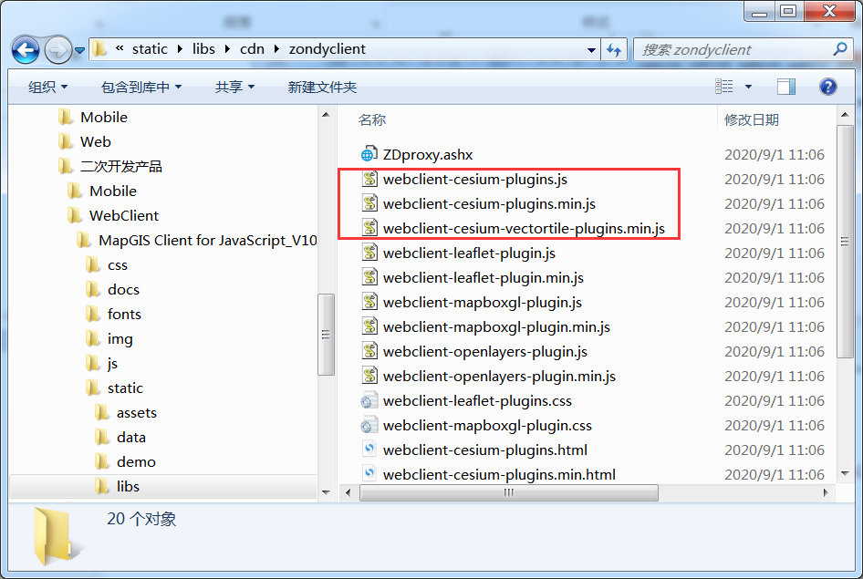
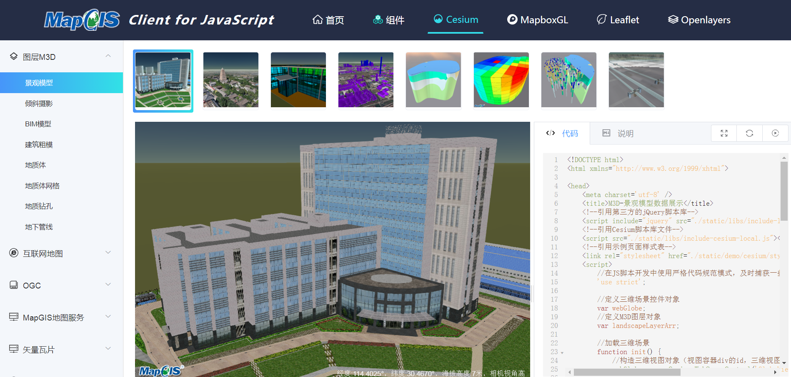
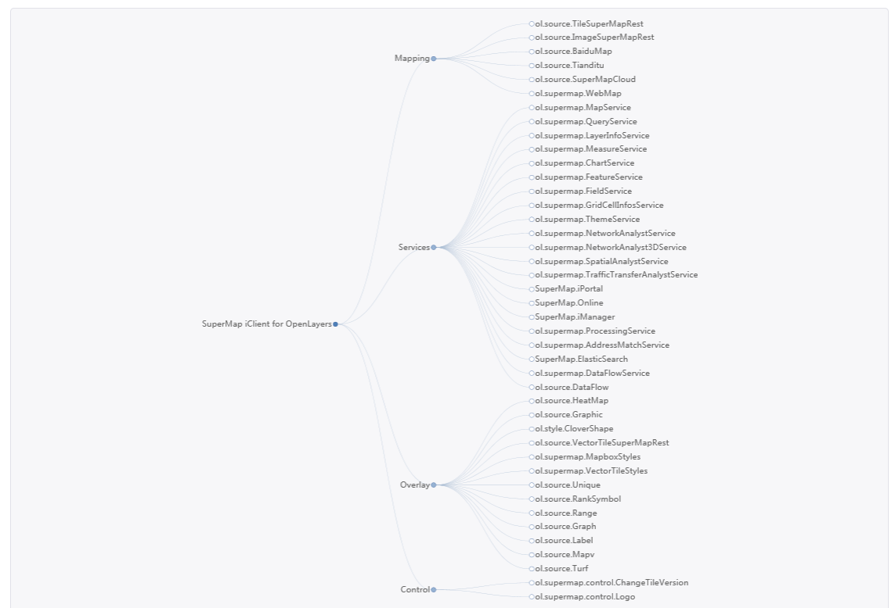

## 产品介绍

&ensp;&ensp;&ensp;&ensp;MapGIS 3DClient for WebGL，即MapGIS Client for JavaScript（Cesium），是一款基于开源三维地图框架Cesium开发的跨浏览器端二次开发产品，零插件、简单、易开发、易扩展，用户可以通过该产品轻松构建功能强大的城市、城市群级别的全空间真三维Web应用。

  
   
  
MapGIS Client for JavaScript产品架构图

 

&ensp;&ensp;&ensp;&ensp;**MapGIS Client for JavaScript（Cesium） SDK**是一套基于Cesium的三维WebGIS开发库，无缝对接MapGIS云存储、云GIS服务器、云应用等产品，在原生Cesium的基础上进行扩展，融合了专业的MapGIS全空间GIS、大数据GIS、智能GIS能力，为全空间二三维一体化Web应用提供JavaScript功能接口，可帮助您快速构建三维WebGIS应用。

> MapGIS Client for JavaScript (Cesium) SDK包含了三维WebGIS开发所需的开发库、API、示例等，结合<a href="http://www.smaryun.com/dev/resource_center.html#/type27/tag10/page1" target="_blank">司马云开发世界资源中心</a>的配套开发资源，以及<a href="http://www.smaryun.com/cloudlisten/index.php" target="_blank">云听社区</a>、开源社区<a href="https://github.com/MapGIS/WebClient-JavaScript" target="_blank">GitHub</a> 、<a href="https://gitee.com/osmapgis/WebClient-JavaScript" target="_blank">Gitee</a>，助力开发者高效开发。

### Cesium

&ensp;&ensp;&ensp;&ensp;Cesium是一个用于显示三维地球和地图的开源JavaScript库，是一个使用WebGL的地图引擎。支持球面、平面模式的二三维地图展示，提供良好的三维图形标绘与交互功能，以及场景模拟表达能力，具有最佳的性能、精度、视觉质量和易用性。从航空航天到智能城市再到无人机，各个行业的开发者都在使用Cesium来创建交互式Web应用程序，来共享动态地理空间数据。使用Cesium可显示海量三维模型数据、影像数据、地形高程数据、矢量数据等，三维模型格式支持gltf、三维瓦片模型格式支持3d tiles；矢量数据支持geojson、topojson格式；影像数据支持wmts等；高程支持STK格式。

>详情请参考<a href="https://cesium.com/platform/cesiumjs/" target="_blank">Cesium官网</a>地址

## 产品特点

### 全空间的数据融合能力

&ensp;&ensp;&ensp;&ensp;提供地上地下、室内室外、空中地表全空间多源数据集成，从宏观到微观展示城市空间全要素。融合倾斜摄影、BIM、激光点云、物联感知数据、RTSP视频数据等多源异构数据，多角度、多粒度全面展示物理空间本源。

### 大体量数据承载及渲染

- 通过建立LOD、多级缓存、数据高效压缩等多种优化措施，支持大数据量地形可视化，以及多层影像数据的叠加显示。
- 通过多级LOD技术，视锥体裁剪、可视范围调度等技术支持海量三维模型数据的快速渲染。
- 支持海量三维数据网络应用数据交换格式（M3D），对海量三维模型数据进行网格划分与分层组织，采用流式传输模式，实现多端一体的高效解析和渲染。

### 强大的空间数据三维分析能力

&ensp;&ensp;&ensp;&ensp;全面支持离散空间的三维数据模型的分析与计算，包括通视分析、可视域分析、动态可视域分析、开挖分析、透明地表分析、动态剖切分析、天际线分析、日照分析、阴影率分析、模型爆炸分析、X射线分析等，通过三维场景的可视化，展示三维模型之间的空间关系，为城市规划与监管、地下空间利用与开发提供科学依据和辅助决策。

### 炫酷的大数据客户端可视化

- 通过开源技术（EchartGL、MapV、d3等），提供蜂窝图、热力图、聚类、密度、时空立方体等多种客户端可视化表达方式。
- 支持大体量的实时数据客户端绘制渲染，广泛应用于车联网、物联网，实现轨迹跟踪、轨迹渲染、实时视频投影等应用场景。
- 于SVG实现大数据专题图的无损缩放和动态交互

## 资源下载

&ensp;&ensp;&ensp;&ensp;MapGIS Client for JavaScript为开源产品，可从司马云-云开发世界下载正式发布的产品包，也可从开源社区（Gitee、GitHub）直接拉取。

&ensp;&ensp;&ensp;&ensp;MapGIS官方下载地址：<a href="http://smaryun.com/dev/download_detail.html#/download828" targer="_blank">http://smaryun.com/dev/download_detail.html#/download828</a>

&ensp;&ensp;&ensp;&ensp;GitHub 托管地址：<a href="https://github.com/MapGIS/WebClient-JavaScript" targer="_blank">https://github.com/MapGIS/WebClient-JavaScript</a>

&ensp;&ensp;&ensp;&ensp;Gitee 托管地址：<a href="https://gitee.com/osmapgis/WebClient-JavaScript" targer="_blank">https://gitee.com/osmapgis/WebClient-JavaScript</a>

## 开发环境

&ensp;&ensp;&ensp;&ensp;MapGIS Client for JavaScript产品已开源不收取费用，开发者可自行<a href="#download">下载开发资源</a>。
&ensp;&ensp;&ensp;&ensp;基于MapGIS服务器产品的WebGIS系统应用开发，__开发免费，商用收费__。对系统硬件环境没有特别要求，操作系统支持Microsoft Windows系列，包括Win7、Win8、Win10、Win Server2003、Win Server2008、Win Server2012、Win XP等，以及Linux 系列，包括redHat、ubnutu、centos等操作系统，均支持32位与64位机器。一般需要依次安装配置下列软件环境：

### MapGIS开发平台：

* MapGIS IGServer .NET版：获取<a href="http://smaryun.com/dev/download_detail.html#/download689" targer="_blank">MapGIS IGServer .NET x64 for Windows开发包</a>，软件安装详细说明请参见<a href="http://www.smaryun.com/dev/resource_center.html#/type27/tag206/page1/doc783" targer="_blank">《MapGIS IGServer .NET安装使用说明》</a>；
* MapGIS IGServer（九州）版：九州版服务器产品暂无开发版本，请试用正式版<a href="http://smaryun.com/goods.php?id=3193" targer="_blank">MapGIS IGServer(九州)安装包</a>，详细安装说明请参见<a href="http://www.smaryun.com/dev/resource_center.html#/type27/tag212/page1/doc823" targer="_blank">《MapGIS IGServer（九州）操作手册》</a>。

### 集成开发环境：
* .NET版：安装Microsoft Visual Studio（2015及以上）、Visual StudioCode等IDE；
* Java版：安装JDK，Eclipse/MyEclipse、WebStorm等IDE。

## 开发授权

&ensp;&ensp;&ensp;&ensp;您可以通过访问<a href="http://www.smaryun.com/" targer="_blank">司马云官方网站</a>获得开发者授权。申请免费开发授权请看<a href="http://smaryun.com/helper.php#/16" targer="_blank">帮助中心</a>目前提供免费云开发授权与硬KEY开发授权两种模式，开发者可结合实际应用需求选用。
* 免费云开发授权需要在有网环境下使用
* 硬KEY可在离线环境下完成授权。

## 开发SDK

### 开发包

&ensp;&ensp;&ensp;&ensp;MapGIS Client for JavaScript（Cesium） SDK，含三维WebGIS开发所需的开发库、API、示例、文档等资源，均集成在<a href="http://develop.smaryun.com/#/index" target="_blank">MapGIS Client for JavaScript</a>产品门户中。

### 开发库

&ensp;&ensp;&ensp;&ensp;MapGIS Client for JavaScript （Cesium）为用户提供了专业的三维WebGIS 客户端开发库，同时对接大数据应用提供相关功能接口，旨在帮助用户快速构建内容丰富、响应迅速、美观流畅，具有良好用户体验的WebGIS系统应用。

| 开发库 |  说明           |
| ------------ | -------------- |
| webclient-cesium-plugins.min.js / webclient-cesium-plugins.js（可调试版）| WebGL开发库，基于cesium原生库扩展，对接云GIS服务器产品，支持三维场景操作管理、二三维地图可视化（M3D图层、OGC、互联网地图服务、MapGIS地图服务、通用数据等）、图形绘制、三维数据查询、三维空间分析、轨迹模拟、场景漫游，含场景特效、热力图、动态扫描圆等客户端可视化功能，以及对接大数据应用的客户端可视化与空间分析相关功能 |
| include-cesium-local.js | 二次开发引用库，在此引入了for WebGL的核心库webclient-cesium-plugins.min.js，cesium原生库，以及其他第三方库，同时提供了示例访问MapGIS IGServer服务器的配置 |

  
   
  
MapGIS Client for JavaScript（Cesium）开发库

 

>核心库分别提供压缩版（webclient-cesium-plugins.min.js）与开发版（webclient-cesium-plugins.js）两个版本，min版一般在应用开发完成后发布部署阶段使用；二次开发阶段通常使用开发版，方便查阅与调试。

### 开发API

&ensp;&ensp;&ensp;&ensp;MapGIS Client for JavaScript为用户提供离在线API（应用程序编程接口），开发者可以通过API查找学习MapGIS提供的实现功能的方法。

- <a href="http://develop.smaryun.com/docs/cesium/index.html" target="_blank">MapGIS Client for JavaScript（Cesium） API</a>
- <a href="http://develop.smaryun.com/docs/other/mapgis-cesium/index.html" target="_blank">Cesium API</a>（MapGIS扩展的Cesium参考）
- <a href="http://develop.smaryun.com:81/API/Server/RestSimpleDemo/index.htm" target="_blank">MapGIS IGServer REST API</a>（服务端API参考）
- <a href="https://cesium.com/docs/cesiumjs-ref-doc/" target="_blank">Cesium API</a>（原生参考）

### 开发示例

&ensp;&ensp;&ensp;&ensp;MapGIS Client for JavaScript（Cesium）为用户提供了功能全面的接口示例与配套文档，支持离在线访问，源码与效果可共同展现，同时提供即时编辑与运行功能，可以帮助您进行高效开发。

- 在线使用：<a href="http://develop.smaryun.com/#/gallery/cesium" target="_blank">MapGIS Client for JavaScript （Cesium）示例</a>
- 离线使用：方式一，可在云开发世界下载<a href="http://www.smaryun.com/dev/download_detail.html#/download828" target="_blank">MapGIS Client for JavaScript开发包</a>，解压后按说明步骤发布即可；方式二，可通过开源社区拉取整套源码，然后编译运行，此略

  
   
  
MapGIS Client for JavaScript（Cesium）开发示例

### 开发模式

&ensp;&ensp;&ensp;&ensp;针对WebGIS应用开发，有以下几种开发模式：
- 方式一：基于MapGIS IGServer等云GIS服务器提供的服务资源，使用MapGIS Client for JavaScript二次开发库的核心库，采用传统开发方式-**H5原生JS方式**构建您的应用系统
- 方式二：以H5原生JS开发方式为基础，遵循统一的开发标准规范，将应用开发拆分为“开发框架+功能插件”方式，并通过桥梁（标准的JSON配置文件）进行动态衔接，即“纵生”式开发方式
- 方式三：采用**组件式Vue开发方式**，该方式将提供丰富的Vue组件资源，全面提升开发效率

## 功能模块

&ensp;&ensp;&ensp;&ensp;MapGIS Client for JavaScript（Cesium）的**核心库**为**webclient-cesium-plugins.min.js**，是基于开源框架Cesium进行扩展，面向客户端Web三维应用进行全新封装的脚本库，提供访问云GIS服务器的数据、服务、资源的能力。包括2D矢量、2D瓦片、3D地形、M3D模型缓存等；支持第三方地图服务，包括Google、高德、百度、天地图、天地图WMTS、OpenWeather、吉威WMTS；支持通用数据加载，包括通用模型文件的单个或批量操作（KML、KMZ、CZML、GLTF、GeoJson）；支持添加、删除常规的点、线、面、图片、注记、PopUP等标绘功能；支持三维场景粒子特效、热力图、动态扫描圆等客户端可视化功能；重点提供丰富的三维分析功能，包括坡度坡向量测、洪水淹没模拟、挖填方计算、通视分析、可视域分析、天际线分析等功能。

**简要列出SDK所提供的功能，画功能导图（参见超图模块说明）**

### API 功能体系

  
   
  
MapGIS Client for JavaScript（Cesium）功能模块(待替换)

### API 结构说明

&ensp;&ensp;&ensp;&ensp;MapGIS Client for JavaScript（Cesium）二次开发库的提供的开发接口如下图所示：

  
   
  
基于Cesium扩展的mapgis开发接口

 

## 产品更新

### V10.5.2.10

1. 

### V10.5.0.10

1. 全面整合了Cesium等脚本库，代码模块化，采用最新的JavaScript ES6标准；
2. 提供Cesium开发库、示例、API，支持二三维数据可视化（含M3D、OGC、MapGIS地图服务、第三方地图服务等）、图形绘制、量算、模型漫游、三维查询与分析、场景特效，以及三维场景下的大数据可视化与分析等功能；
3. Cesium示例全面优化，提供配套示例说明文档与API；
4. 新增集成Echarts、MapV可视化库，支持在Web三维模式下实现大数据可视化、大数据分析功能；
5. 新增集成 Turf.js客户端空间分析库，提供Web三维客户端空间计算能力。

## 相关产品

> **面向Web应用开发，依赖MapGIS相关产品：**
> - **桌面端GIS工具产品**，MapGIS Desktop作为一个数据处理的桌面GIS工具，主要用于数据存储管理与地图制图；MapGIS 3D SceneBuilder主要用于地上景观模型快速构建；MapGIS 3D GeoModeler是地学建模工具，主要面向地下空间构建三维城市部件模型、地质体模型等；
> - **云GIS服务器产品-MapGIS IGServer、MapGIS IGServer-X、MapGIS IGServer-S**，作为云GIS服务器为Web应用提供高性能GIS、大数据GIS、人工智能GIS三大方向的地图、服务与资源；
> - **云存储产品-MapGIS DataStore**与MapGIS SDE无缝融合，为Web应用提供强大的数据层支撑。

### MapGIS Desktop

&ensp;&ensp;&ensp;&ensp;**MapGIS Desktop**是一个专业的二三维一体化桌面GIS产品，具备强大的数据管理与编辑、数据制图与可视化、空间分析与影像处理、三维可视化与分析等能力，通过“框架+插件”的思想构建，支持按需定制。

&ensp;&ensp;&ensp;&ensp;**MapGIS Desktop 九州**是一个专业的跨平台桌面GIS产品，基于跨平台微内核构建，全面适配全国产化环境。在原有MapGIS Desktop产品功能基础上，重点增强了全国产化适配支持。

### MapGIS 3D SceneBuilder、MapGIS 3D GeoModeler

&ensp;&ensp;&ensp;&ensp;**MapGIS 3D SceneBuilder**是一个城市空间三维模型构建工具，提供多样化的建模方法，基于二维矢量或CAD数据，实现三维城市部件的快速、批量、自动化构建。融合丰富的粒子特效和三维分析工具，实现智慧城市的三维专业分析与应用。

&ensp;&ensp;&ensp;&ensp;**MapGIS 3D GeoModeler**是一个三维地学建模、可视化和分析的工具。融合钻孔、剖面、物化探等多源地学数据，通过自动和半自动化的快速建模技术，构建含断层、透镜体等复杂地学特征的结构和属性模型，实现地学模型的全流程一体化构建，并提供基于地学特征的可视化表达和分析功能。

### MapGIS IGServer、MapGIS IGServer-X、MapGIS IGServer-S

&ensp;&ensp;&ensp;&ensp;**MapGIS IGServer**是一款跨平台的高性能GIS服务器产品，也是一款浏览器端GIS应用与开发的平台软件。为用户提供强大的空间数据管理、分析、可视化及共享服务，支持用户进行各行业领域的WebGIS应用开发与扩展。

&ensp;&ensp;&ensp;&ensp;**MapGIS IGServer-X**是一款大数据GIS服务器产品，提供矢量大数据、实时大数据、影像大数据和文本大数据等高性能计算服务，实现多维时空大数据的分析与挖掘。

&ensp;&ensp;&ensp;&ensp;**MapGIS IGServer-S**是一款智能GIS服务器产品，基于深度学习框架，提供数据关联与融合、空间分析与预测、聚类分类与统计等智能化服务，应用于遥感影像变化检测、建筑物提取等领域。

### MapGIS DataStore

&ensp;&ensp;&ensp;&ensp;**MapGIS DataStore**产品是以分布式的方式存储和管理关系型数据、切片型数据、实时型数据以及非结构数据的混合数据库，与MapGIS SDE无缝融合，形成完整的地理大数据存储管理方案。

> 请访问<a href="http://www.smaryun.com/" targer="_blank">司马云资源中心</a>获取MapGIS相关产品的产品配套资料

## 三方产品

**第三方依赖产品：**

&ensp;&ensp;&ensp;&ensp;

-  Cesium：用于显示三维地球和地图的开源JavaScript库，基于WebGL的地图引擎（https://cesium.com/platform/cesiumjs/）

- ECharts：基于 JavaScript 的开源可视化图表库（https://echarts.apache.org/zh/index.html）

- MapV：地理信息可视化开源库（https://mapv.baidu.com/）

- Turf：客户端空间分析开源库（https://turfjs.org/）

- D3：基于Web标准的JavaScript图形可视化库（https://d3js.org/）

