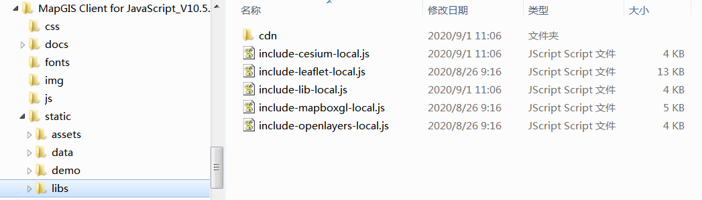

## 准备开发

&ensp;&ensp;&ensp;&ensp;进行WebGIS应用开发，一般均采用前端开发库+GIS服务的模式，开发者须完成如下三个步骤：

&ensp;&ensp;&ensp;&ensp;**第一步：<font color=red>安装配置开发环境</font>，包括MapGIS开发环境（含开发授权）、集成开发环境；**

&ensp;&ensp;&ensp;&ensp;根据实际应用需求，选择.NET或九州系列MapGIS开发平台产品安装，通常包括MapGIS Desktop桌面工具、MapGIS IGServer等云GIS产品。

&ensp;&ensp;&ensp;&ensp;例如选用.NET版本，常用环境如下：
- MapGIS开发包：<a href="http://smaryun.com/dev/download_detail.html#/download689" targer="_blank">MapGIS IGServer .NET x64 for Windows开发包</a>
- MapGIS开发授权：<a href="http://www.smaryun.com/dev/dev_auth_detail.php" targer="_blank">云开发授权</a>（基础版/高级版）
- 集成开发环境：Visual Studio Code

&ensp;&ensp;&ensp;&ensp;**第二步：<font color=red>发布GIS服务资源</font>，在MapGIS IGServer的服务管理器中发布所需的地图服务，以及扩展的功能服务等；**

&ensp;&ensp;&ensp;&ensp;基于MapGIS Server Manager发布地图服务的具体操作，请查看**MapGIS IGServer操作手册**（<a href="http://www.smaryun.com/dev/resource_center.html#/type27/tag206/page1/doc770" target="_blank">.NET版</a>，<a href="http://www.smaryun.com/dev/resource_center.html#/type27/tag212/page1/doc823" target="_blank">九州版</a>）

&ensp;&ensp;&ensp;&ensp;在访问MapGIS IGServer的服务时，需要先确定GIS服务器IP地址与服务端口号；在二次开发时，根据所使用的MapGIS IGServer平台版本以及其服务管理器中IGServer配置情况（ip、port），对二次开发接口中涉及的地图服务访问的ip、port进行相应设置。

- .NET版：IGServer服务管理器访问默认地址（127.0.0.1:9999）、IGServer服务访问默认基地址（127.0.0.1:6163）
- 九州版：IGServer服务管理器访问默认地址（127.0.0.1:8089）、IGServer服务访问默认基地址（127.0.0.1:8089）
  
&ensp;&ensp;&ensp;&ensp;**第三步：<font color=red>获取前端开发库（MapGIS Client for JavaScript开发库）</font>**，通过文件拷贝或npm方式引用开发库，进行WebGIS二维或三维应用开发。

- MapGIS官方下载地址：<a href="http://smaryun.com/dev/download_detail.html#/download828" targer="_blank">http://smaryun.com/dev/download_detail.html#/download828</a>
- GitHub 托管地址：<a href="https://github.com/MapGIS/WebClient-JavaScript" targer="_blank">https://github.com/MapGIS/WebClient-JavaScript</a>
- Gitee 托管地址：<a href="https://gitee.com/osmapgis/WebClient-JavaScript" targer="_blank">https://gitee.com/osmapgis/WebClient-JavaScript</a>

### 引入开发库


#### 文件方式（离线）

&ensp;&ensp;&ensp;&ensp;请下载MapGIS Client for JavaScript开发包，将开发库目录libs下的cdn文件夹与include-xx.js文件放在工程同一目录下，然后在网页中引入对应的include-xx.js文件即可，可以将整个目录[..\static\libs]拷贝到工程中

> 离线版本的核心原理就是根据include=""中的名字，在当前cdn文件夹下寻找对应的js的脚本并按照规定的顺序引入到浏览器中
> “include-*.js 通过include="xxx"的方式自动寻找引入对应的第三方脚本”

&ensp;&ensp;&ensp;&ensp;新建一个 HTML 文件，在 <head> 标签中引入 MapGIS Client for JavaScript（MapboxGL）的开发库：

- Example:

  ```javascript
  <script src="libs/include-mapboxgl-local.js"></script>
  ```



#### nmp方式（在线）


## 开始开发

&ensp;&ensp;&ensp;&ensp;先根据“开发环境”要求安装配置好MapGIS开发环境（含MapGIS云开发授权），然后获取MapGIS Client for JavaScript（MapboxGL）SDK进行二次开发。

&ensp;&ensp;&ensp;&ensp;下面使用H5原生JS方式，演示如何在网页中显示一幅MapGIS矢量地图。

### 数据准备

&ensp;&ensp;&ensp;&ensp;本示例使用MapGIS官方云端（develop.smaryun.com）已经发布的名称为“北京市”（或“SampleDoc”）的地图文档进行演示。若您需要显示自己的地图文档，需要先附加待显示地图数据所在的地理数据库，然后通过**MapGIS Server Manager**配置GIS服务环境并发布地图服务。

<center>
  
  <br>
  <div class="notes">MapGIS Server Manager发布服务</div>
</center>
<br/>

> 基于MapGIS Server Manager发布地图服务的具体操作，请查看**MapGIS IGServer操作手册**（<a href="http://www.smaryun.com/dev/resource_center.html#/type27/tag206/page1/doc770" target="_blank">.NET版</a>，<a href="http://www.smaryun.com/dev/resource_center.html#/type27/tag212/page1/doc823" target="_blank">九州版</a>）

### 开发入门：创建一幅地图

> 本示例使用的开发集成工具为 Visual Studio Code（简称VSCode），您可以根据开发习惯选择适合自己的开发工具

#### Step 1. 新建Web网站

&ensp;&ensp;&ensp;&ensp;在VSCode或本地磁盘中新建一个文件目录作为Web网站目录，名称为MapDisplay；

<center>
  
  <br>
  <div class="notes">新建网站目录</div>
</center>
<br/>

#### Step 2. 引入JavaScript开发库（离线方式）

&ensp;&ensp;&ensp;&ensp;在新建的Web网站（文件目录）中，拷贝MapGIS Client for JavaScript（MapboxGL）开发库到网站根目录下，即将SDK包路径MapGIS Client for JavaScript_V10.5.X.X\static\libs的libs拷贝到“MapDisplay”目录下。此libs包含了全部的开发库（js与css文件），可选择只拷贝MapboxGL的库。

<center>
  
  <br>
  <div class="notes">引入脚本库资源</div>
</center>
<br/>

#### Step 3. 加载显示地图

(1) 在上述新建的网站中，通过新建文件方式，创建一个名称为“MapDocDisplay”的html网页文件，可通过自定义模板快速创建网页结构内容；

<center>
  
  <br>
  <div class="notes">新建HTML页面（空）</div>
</center>
<br/>

<center>
  
  <br>
  <div class="notes">新建HTML页面（模板）</div>
</center>
<br/>

(2) 设置示例标题，在该页面引入MapboxGL开发的必要脚本库include-mapboxgl-local.js，此脚本库会动态引入核心库webclient-mapboxgl-plugin.min.js与相关第三方库、样式文件等；

<center>
  
  <br>
  <div class="notes">引用开发库</div>
</center>
<br/>


(3) 创建一个ID为“mapCon”的div层，并设置其样式，用来作为显示矢量地图文档的地图容器;

<center>
  
  <br>
  <div class="notes">创建div层并设置样式</div>
</center>
<br/>

(4) 通过body的onload事件触发调用矢量地图文档显示的脚本函数init()；

<center>
  
  <br>
  <div class="notes">body的onload事件</div>
</center>
<br/>

- Example:

  ```HTML
  <body onload="init()">
    <div id="mapCon" style="width: 100%; height: 100%; position: absolute;">
    </div>
  </body>
  ```

(5) 在该页面中嵌入JavaScript代码，实现矢量地图文档显示的脚本函数init()，即初始化mapboxgl.Map与mapboxgl.Zondy.Map.MapDocLayer类，通过设置Map对象的设置初始化地图的中心点、显示级别，再通过docLayer对象的addToMap方法加载矢量地图文档;

> 注意：通常情况下，功能实现的JavaScript代码可以单独放置到一个JS文件中，便于维护

<center>
  
  <br>
  <div class="notes">矢量地图文档显示的脚本函数init()</div>
</center>

- Example:

  ```javascript
        /** 初始化地图显示*/
        function init() {
            "use strict";
            //地图容器
            var map = new mapboxgl.Map({
                container: 'mapCon',
                crs: 'EPSG:4326',
                minZoom: 3,
                zoom: 9,
                center: [116.39, 39.90]
            });
            var navigationControl = new mapboxgl.NavigationControl();
            map.addControl(navigationControl, 'top-left');
            var { protocol, ip, port } = window.webclient;
            var docLayer = new mapboxgl.Zondy.Map.MapDocLayer("北京市", {
                layerID: 'mapgis-doc-beijing',
                //IP地址
                ip: "develop.smaryun.com",
                //端口号
                port: 6163,
                //只显示一个图层,不平铺显示
                noWrap: true,
                serverType: 'doc',
                tileSize: 512
            });
            docLayer.addToMap(map);
        }
  ```


#### Step 4. 运行调试

&ensp;&ensp;&ensp;&ensp;VSCode是一个非常流行的Web前端开发IDE，在编写Web网站时一般需要发布后编译运行，也可安装相关插件调试运行。

&ensp;&ensp;&ensp;&ensp;在此，可先将“MapDisplay”站点发布，然后通过浏览器查看与调试。例如：在IIS中发布站点后，右键“浏览”选中的“MapDocDisplay.html”文件，即可在浏览器中查看，并进行前端调试。

<center>
  
  <br>
  <div class="notes">在IIS中浏览网页</div>
</center>
<br/>
<center>
  
  <br>
  <div class="notes">矢量地图文档显示效果图</div>
</center>
<br/>
&ensp;&ensp;&ensp;&ensp;需要调试时，可以利用浏览器的开发者工具进行测试，例如IE、Firefox、Chrome等。打开浏览器的开发者工具，在代码行前端设置断点，然后在浏览器中重新运行示例页面，程序将会运行进入到代码断点处，方便查看相关信息。


## 服务发布

&ensp;&ensp;&ensp;&ensp;在此以发布地图文档（REST模式）为例，发布单个地图文档的配置操作如下：
在MapGIS Server Manager页面左侧导航栏中的“地图与数据服务”中，单击“发布服务”，在下拉菜单中选择“文档发布（包括WMS/WFS/WMTS）”选项。页面跳转至发布服务配置页面。
 
<center>
  
  <br>
  <div class="notes">MapGIS Server Manager发布服务</div>
</center>
<br/>

&ensp;&ensp;&ensp;&ensp;配置项参数说明：
1. 选取地图文档：点击“地图文档路径”后的“浏览”按钮，在服务器磁盘中选择发布的地图文档（.mapx），选取后自动读取该文档的名称。矢量地图文档分为如下两种类型，即本地数据源、远程数据源（也称网络数据源，即关系数据库存储地理数据的GDBServer）。

- 本地数据源（HDF）：适用于地理数据库文件，存在并且添加到MapGIS IGServer中，对应的gdbServer名称为“MapGISLocal”，gdb用户名和密码为空；
- 本地数据源（HDB）【推荐使用】：适用于地理数据库文件，存在并且添加到MapGIS IGServer中，对应的gdbServer名称为“MapGISLocalPlus”，gdb用户名和密码为空；
- 远程数据源：适用于地图文档所调用要素图层数据，存在于非本地数据库中，如Oracle数据库；

> MapGIS IGServer(九州)支持本地数据源HDB方式，不支持本地数据源HDF方式。

2. 发布地图文档：在服务器磁盘中找到需要发布的mapx地图文档并添加之后，点击“发布”按钮，即可发布二维地图文档为MapGIS Rest地图服务格式；
3. 获取地图服务的基地址与相关信息，用于Web应用开发。


## 地图控件


## 图形标绘


## 地图服务


## 地图查询


## 地图编辑


