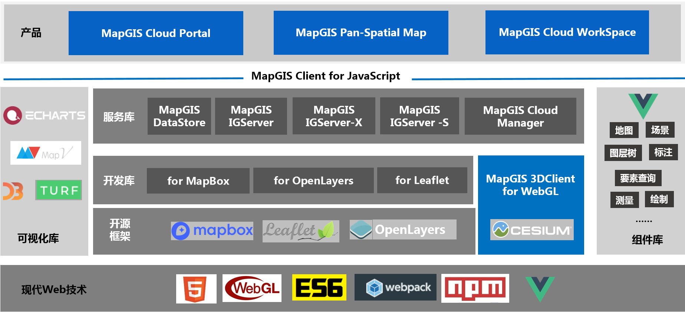

## 产品介绍

&ensp;&ensp;&ensp;&ensp;MapGIS Client for JavaScript（MapboxGL）是一套基于MapboxGL的云GIS网络客户端开发平台，无缝对接MapGIS云存储、云GIS服务器与云应用产品，能有效集成云端的地图、服务与资源，提供全面的WebGIS开发应用能力，支持高效地图可视化与分析应用功能，增强了大数据、实时流数据的高效可视化表达和分析功能。

  
   
  
MapGIS Client for JavaScript产品架构图

 

&ensp;&ensp;&ensp;&ensp;**MapGIS Client for JavaScript（MapboxGL） SDK**是一套由Javascript语言编写的应用程序接口，该SDK基于MapboxGL，主要对MapGIS IGServer等云产品所提供的REST标准服务接口进行脚本层封装，进一步减少调用代码量、降低难度，简化用户开发。此外，该套SDK中集成了MapboxGL原生接口和基于MapboxGL扩展的功能接口，极大的丰富了SDK的功能和应用场景，可帮助您快速构建WebGIS应用。

> MapGIS Client for JavaScript (MapboxGL) SDK包含了WebGIS开发所需的开发库、API、示例等，结合<a href="http://www.smaryun.com/dev/resource_center.html#/type27/tag10/page1" target="_blank">司马云开发世界资源中心</a>的配套开发资源，以及<a href="http://www.smaryun.com/cloudlisten/index.php" target="_blank">云听社区</a>、开源社区<a href="https://github.com/MapGIS/WebClient-JavaScript" target="_blank">GitHub</a> 、<a href="https://gitee.com/osmapgis/WebClient-JavaScript" target="_blank">Gitee</a>，助力开发者高效开发。

### MapboxGL

&ensp;&ensp;&ensp;&ensp;MapboxGLJS（mapbox-gl.js ）是Mapbox（即数字地图初创企业，成立于2010年，旨在为企业提供一系列GIS工具）提供的一个开源JavaScript库，使用WebGL渲染交互式矢量瓦片地图和栅格瓦片地图。WebGL渲染意味着高性能，MapboxGL能够渲染大量的地图要素，拥有流畅的交互以及动画效果、可以显示立体地图并且支持移动端，是一款十分优秀的WebGIS开发框架。mapbox-gl.js作为前端渲染矢量瓦片交互地图的工具，支持Mapbox Style样式设置，这是它最为吸引人的特性之一。需要注意的是，mapbox-gl.js是使用WebGL技术独立渲染前端库，浏览器必须支持WebGL渲染。

>详情请参考<a href="https://www.mapbox.com/mapbox-gl-js/api/" target="_blank">MapboxGL官网</a>地址

### 主流地图库特点

- MapboxGL：基于WebGL独立渲染的开源二维地图库，其推出的矢量瓦片可视化效果和性能都很出众，标准被业内认可；
- Leaflet：一款比较成熟的轻量级开源二维地图库，小而精悍，体验好，实践多、社区活跃、插件非常丰富，Mapbox早期的地图库就是基于Leaflet开发；
- OpenLayers：一套比较老牌和体系比较成熟的开源二维地图库，功能丰富且稳定，业内广泛使用，浏览器兼容好（兼容IE6及以上版本浏览器）；

## 资源下载

&ensp;&ensp;&ensp;&ensp;MapGIS Client for JavaScript为开源产品，可从司马云-云开发世界下载正式发布的产品包，也可从开源社区（Gitee、GitHub）直接拉取。

&ensp;&ensp;&ensp;&ensp;MapGIS官方下载地址：<a href="http://smaryun.com/dev/download_detail.html#/download828" targer="_blank">http://smaryun.com/dev/download_detail.html#/download828</a>

&ensp;&ensp;&ensp;&ensp;GitHub 托管地址：<a href="https://github.com/MapGIS/WebClient-JavaScript" targer="_blank">https://github.com/MapGIS/WebClient-JavaScript</a>

&ensp;&ensp;&ensp;&ensp;Gitee 托管地址：<a href="https://gitee.com/osmapgis/WebClient-JavaScript" targer="_blank">https://gitee.com/osmapgis/WebClient-JavaScript</a>

## 开发环境

&ensp;&ensp;&ensp;&ensp;MapGIS Client for JavaScript产品已开源不收取费用，开发者可自行<a href="#download">下载开发资源</a>。
&ensp;&ensp;&ensp;&ensp;基于MapGIS服务器产品的WebGIS系统应用开发，__开发免费，商用收费__。对系统硬件环境没有特别要求，操作系统支持Microsoft Windows系列，包括Win7、Win8、Win10、Win Server2003、Win Server2008、Win Server2012、Win XP等，以及Linux 系列，包括redHat、ubnutu、centos等操作系统，均支持32位与64位机器。一般需要依次安装配置下列软件环境：

### MapGIS开发平台：

* MapGIS IGServer .NET版：获取<a href="http://smaryun.com/dev/download_detail.html#/download689" targer="_blank">MapGIS IGServer .NET x64 for Windows开发包</a>，软件安装详细说明请参见<a href="http://www.smaryun.com/dev/resource_center.html#/type27/tag206/page1/doc783" targer="_blank">《MapGIS IGServer .NET安装使用说明》</a>；
* MapGIS IGServer（九州）版：九州版服务器产品暂无开发版本，请试用正式版<a href="http://smaryun.com/goods.php?id=3193" targer="_blank">MapGIS IGServer(九州)安装包</a>，详细安装说明请参见<a href="http://www.smaryun.com/dev/resource_center.html#/type27/tag212/page1/doc823" targer="_blank">《MapGIS IGServer（九州）操作手册》</a>。

### 集成开发环境：
* .NET版：安装Microsoft Visual Studio（2015及以上）、Visual StudioCode等IDE；
* Java版：安装JDK，Eclipse/MyEclipse、WebStorm等IDE。

## 开发授权

&ensp;&ensp;&ensp;&ensp;您可以通过访问<a href="http://www.smaryun.com/" targer="_blank">司马云官方网站</a>获得开发者授权。申请免费开发授权请看<a href="http://smaryun.com/helper.php#/16" targer="_blank">帮助中心</a>目前提供免费云开发授权与硬KEY开发授权两种模式，开发者可结合实际应用需求选用。
* 免费云开发授权需要在有网环境下使用
* 硬KEY可在离线环境下完成授权。

## 开发SDK

### 开发包

&ensp;&ensp;&ensp;&ensp;MapGIS Client for JavaScript（MapboxGL） SDK，含WebGIS开发所需的开发库、API、示例、文档等资源，均集成在<a href="http://develop.smaryun.com/#/index" target="_blank">MapGIS Client for JavaScript</a>产品门户中。

### 开发库

&ensp;&ensp;&ensp;&ensp;MapGIS Client for JavaScript （MapboxGL）为用户提供了专业的二维WebGIS 客户端开发库，同时对接大数据应用提供相关功能接口，旨在帮助用户快速构建内容丰富、响应迅速、美观流畅，具有良好用户体验的WebGIS系统应用。

| 开发库 |  说明           |
| ------ | -------------- |
| webclient-mapboxgl-plugin.min.js / webclient-mapboxgl-plugin.js（可调试版） | MapboxGL开发库，包括基本操作、图形绘制、事件监听等功能，同时支持标准的OGC服务（WMS、WFS、WCS等），提供显示、数据管理、查询、编辑、专题图、统计图、分析等全WebGIS功能，以及大数据分析相关功能，其矢量大数据功能如矢量瓦片比较出众 |
| include-mapboxgl-local.js | 二次开发引用库，在此引入了MapGIS Client for JavaScript（MapboxGL）的核心库webclient-mapboxgl-plugin.min.js， MapboxGL原生库，以及其他第三方库，同时提供了示例访问MapGIS IGServer服务器的配置 |

  
   
  
MapGIS Client for JavaScript（MapboxGL）开发库

 

>核心库分别提供压缩版（webclient-mapboxgl-plugin.min.js）与开发版（webclient-mapboxgl-plugin.js）两个版本，min版一般在应用开发完成后发布部署阶段使用；二次开发阶段通常使用开发版，方便查阅与调试。

### 开发API

&ensp;&ensp;&ensp;&ensp;MapGIS Client for JavaScript为用户提供离在线API（应用程序编程接口），开发者可以通过API查找学习MapGIS提供的实现功能的方法。

- <a href="http://develop.smaryun.com/docs/mapboxgl/index.html" target="_blank">MapGIS Client for JavaScript（MapboxGL） API</a>
- <a href="http://develop.smaryun.com:81/API/Server/RestSimpleDemo/index.htm" target="_blank">MapGIS IGServer REST API</a>（服务端API参考）
- <a href="https://www.mapbox.com/mapbox-gl-js/api/" target="_blank">MapboxGL API</a>（MapboxGL原生API参考）

### 开发示例

&ensp;&ensp;&ensp;&ensp;MapGIS Client for JavaScript（MapboxGL）为用户提供了功能全面的接口示例与配套文档，支持离在线访问，源码与效果可共同展现，同时提供即时编辑与运行功能，可以帮助您进行高效开发。

- 在线使用：<a href="http://develop.smaryun.com/#/gallery/mapboxgl" target="_blank">MapGIS Client for JavaScript （MapboxGL）示例</a>
- 离线使用：方式一，可在云开发世界下载<a href="http://www.smaryun.com/dev/download_detail.html#/download828" target="_blank">MapGIS Client for JavaScript开发包</a>，解压后按说明步骤发布即可；方式二，可通过开源社区拉取整套源码，然后编译运行，此略

  
   
  
MapGIS Client for JavaScript（MapboxGL）开发示例

### 开发模式

&ensp;&ensp;&ensp;&ensp;针对WebGIS应用开发，有以下几种开发模式：
- 方式一：基于MapGIS IGServer等云GIS服务器提供的服务资源，使用MapGIS Client for JavaScript二次开发库的核心库，采用传统开发方式-**H5原生JS方式**构建您的应用系统
- 方式二：以H5原生JS开发方式为基础，遵循统一的开发标准规范，将应用开发拆分为“开发框架+功能插件”方式，并通过桥梁（标准的JSON配置文件）进行动态衔接，即“纵生”式开发方式
- 方式三：采用**组件式Vue开发方式**，该方式将提供丰富的Vue组件资源，全面提升开发效率

## 功能模块

MapGIS Client for JavaScript（MapboxGL）对接云GIS产品，提供地图显示、数据管理、查询、编辑、专题图、统计图、预案标绘、分析等全WebGIS功能，以及大数据与智能GIS功能，其矢量瓦片可视化效果和性能很出众。

**简要列出SDK所提供的功能，画功能导图（参见超图模块说明）**

### API 功能体系

  
   
  
MapGIS Client for JavaScript（MapboxGL）功能模块(待替换)

### API 结构说明

&ensp;&ensp;&ensp;&ensp;MapGIS Client for JavaScript（MapboxGL）的**核心库**为**webclient-mapboxgl-plugin.min.js**，此开发库实质上是在Web客户端层对调用MapGIS IGServer等云GIS服务器提供的服务的接口封装，通过简便的功能控件、接口便能直接获取使用云GIS服务器提供的数据与功能服务资源。

&ensp;&ensp;&ensp;&ensp;MapboxGL是一个使用WebGL技术独立渲染地图前端库，底层采用WebGL实现，性能和体验显著的提升，主要作为前端渲染矢量瓦片交互地图的工具。此核心库基于MapboxGL框架，对接MapGIS IGServer等云GIS产品，在MapboxGL框架的基础上进行扩展，构造了调用云GIS服务器的数据服务和功能服务的相关类，将前端MapboxGL与云GIS服务器融合，富端强云的结合将会给开发和应用带来更大的便捷、更好客户端体验，其矢量大数据能力突出、性能出色。

&ensp;&ensp;&ensp;&ensp;核心库webclient-mapboxgl-plugin.min.js的接口结构如下图所示：

  
   
  
基于MapboxGL扩展的mapgis开发接口

 

- Map命名空间：调用地图数据资源的类，如矢量地图文档服务、瓦片地图服务等；
- Service命名空间：调用GIS功能资源服务的类，如查询、编辑、分析等功能服务；
- Object命名空间：结构类，或者MapGIS对象类，主要协助地图数据资源类和GIS功能资源类完成资源调用功能。

> 调用GIS服务器资源的类都以简单明了代表实际意义的英文名称来命名，方便用户获取资源调用接口。具体请查看配套的MapboxGL API，在API文档中每个类说明的最前面的文字内容写明了该类的继承类（父类）和子类，供广大用户学习和参考。

## 产品更新

### V10.5.2.10

1. 新增直接支持ArcGIS地图服务与OGC服务；
2. 新增PostGIS支持，可实现基于PostGIS的数据查询统计、实时矢量瓦片等功能；
3. 新增支持ElasticSearch的分布式大数据搜索与分析能力，可实现热力分析、聚类分析等功能。

### V10.5.0.10

1. 全面整合了MapboxGL等脚本库，代码模块化，采用最新的JavaScript ES6标准；
2. 提供MapboxGL开发库、示例、API，支持基于MapboxGL的二维数据可视化（含OGC、MapGIS地图服务、第三方地图服务等）、量算、查询编辑、空间分析、专题图，以及大数据可视化与分析等功能；
3. 新增集成Echarts、Echarts GI、MapV可视化库，支持在Web三维模式下实现大数据可视化、大数据分析功能；
4. 新增集成 Turf.js客户端空间分析库，提供客户端空间计算能力，支持实现在客户端层的空间分析、拓扑分析、空间关系计算等功能；
5. MapboxGL示例全面优化，提供配套示例说明文档与API。

## 相关产品

> **面向Web应用开发，依赖MapGIS相关产品：**
> - **桌面端GIS工具产品-MapGIS Desktop**，作为一个数据处理的桌面GIS工具，主要用于数据存储管理与地图制图；
> - **云GIS服务器产品-MapGIS IGServer、MapGIS IGServer-X、MapGIS IGServer-S**，作为云GIS服务器为Web应用提供高性能GIS、大数据GIS、人工智能GIS三大方向的地图、服务与资源；
> - **云存储产品-MapGIS DataStore**与MapGIS SDE无缝融合，为Web应用提供强大的数据层支撑。

### MapGIS Desktop

&ensp;&ensp;&ensp;&ensp;**MapGIS Desktop**是一个专业的二三维一体化桌面GIS产品，具备强大的数据管理与编辑、数据制图与可视化、空间分析与影像处理、三维可视化与分析等能力，通过“框架+插件”的思想构建，支持按需定制。

&ensp;&ensp;&ensp;&ensp;**MapGIS Desktop 九州**是一个专业的跨平台桌面GIS产品，基于跨平台微内核构建，全面适配全国产化环境。在原有MapGIS Desktop产品功能基础上，重点增强了全国产化适配支持。

### MapGIS IGServer、MapGIS IGServer-X、MapGIS IGServer-S

&ensp;&ensp;&ensp;&ensp;**MapGIS IGServer**是一款跨平台的高性能GIS服务器产品，也是一款浏览器端GIS应用与开发的平台软件。为用户提供强大的空间数据管理、分析、可视化及共享服务，支持用户进行各行业领域的WebGIS应用开发与扩展。

&ensp;&ensp;&ensp;&ensp;**MapGIS IGServer-X**是一款大数据GIS服务器产品，提供矢量大数据、实时大数据、影像大数据和文本大数据等高性能计算服务，实现多维时空大数据的分析与挖掘。

&ensp;&ensp;&ensp;&ensp;**MapGIS IGServer-S**是一款智能GIS服务器产品，基于深度学习框架，提供数据关联与融合、空间分析与预测、聚类分类与统计等智能化服务，应用于遥感影像变化检测、建筑物提取等领域。

### MapGIS DataStore

&ensp;&ensp;&ensp;&ensp;**MapGIS DataStore**产品是以分布式的方式存储和管理关系型数据、切片型数据、实时型数据以及非结构数据的混合数据库，与MapGIS SDE无缝融合，形成完整的地理大数据存储管理方案。

> 请访问<a href="http://www.smaryun.com/" targer="_blank">司马云资源中心</a>获取MapGIS相关产品的产品配套资料

## 三方产品

**第三方依赖产品：**

&ensp;&ensp;&ensp;&ensp;

- MapboxGL：使用WebGL技术独立渲染的开源JavaScript库，作为前端渲染矢量瓦片交互地图的工具（https://docs.mapbox.com/mapbox-gl-js/api/）

- ECharts：基于 JavaScript 的开源可视化图表库（https://echarts.apache.org/zh/index.html）

- MapV：地理信息可视化开源库（https://mapv.baidu.com/）

- Turf：客户端空间分析开源库（https://turfjs.org/）

- D3：基于Web标准的JavaScript图形可视化库（https://d3js.org/）

- ElasticSearch：分布式搜索与分析引擎（https://www.elastic.co/cn/）

- PostGIS：是PostgreSQL的一个扩展，遵循OpenGIS的规范，提供空间信息服务功能-空间对象、空间索引、空间操作函数和空间操作符（http://postgis.net/）

