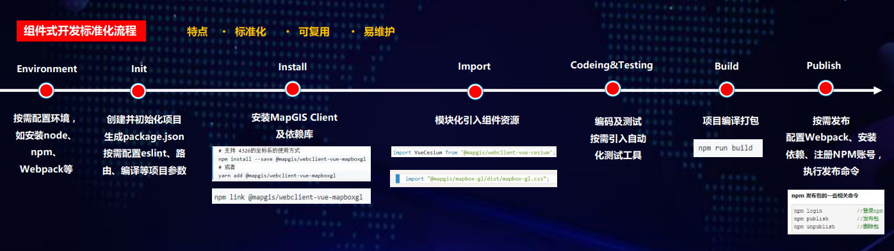

## 开发流程

&ensp;&ensp;&ensp;&ensp;MapGIS Client for JavaScript产品遵循Vue组件标准化开发流程，组件资源提供了开箱即用的函数和属性，允许外部组件调用和扩展。组件间低耦合，可自由组合和多级封装。且产品源码开源，允许用户按需进行源码级改造。从而大幅度的提高应用开发效率，真正实现应用敏捷式开发。

&ensp;&ensp;&ensp;&ensp;开发流程：

1. 按需配置环境，如安装node、npm、Webpack等
2. 创建并初始化项目生成package.json，按需配置eslint、路由、编译等项目参数
3. 安装MapGIS Client for JavaScript及依赖库
4. 模块化引入组件资源
5. 编码及测试，按需引入自动化测试工具
6. 项目编译打包
7. 按需发布，配置Webpack、安装依赖、注册NPM账号，执行发布命令

  
   
  
Vue组件开发流程

 

## 准备开发

&ensp;&ensp;&ensp;&ensp;进行WebGIS应用开发，一般均采用前端开发库+GIS服务的模式，开发者须完成如下三个步骤：

&ensp;&ensp;&ensp;&ensp;**第一步：安装配置开发环境，包括MapGIS开发环境（含开发授权）、集成开发环境；**

&ensp;&ensp;&ensp;&ensp;根据实际应用需求，选择.NET或九州系列MapGIS开发平台产品安装，通常包括MapGIS Desktop桌面工具、MapGIS IGServer等云GIS产品。

&ensp;&ensp;&ensp;&ensp;例如选用.NET版本，常用环境如下：
- MapGIS开发包：<a href="http://smaryun.com/dev/download_detail.html#/download689" targer="_blank">MapGIS IGServer .NET x64 for Windows开发包</a>
- MapGIS开发授权：<a href="http://www.smaryun.com/dev/dev_auth_detail.php" targer="_blank">云开发授权</a>（基础版/高级版）
- 集成开发环境：Visual Studio Code

&ensp;&ensp;&ensp;&ensp;**第二步：发布GIS服务资源，在MapGIS IGServer的服务管理器中发布所需的地图服务，以及扩展的功能服务等；**

&ensp;&ensp;&ensp;&ensp;基于MapGIS Server Manager发布地图服务的具体操作，请查看**MapGIS IGServer操作手册**（<a href="http://www.smaryun.com/dev/resource_center.html#/type27/tag206/page1/doc770" target="_blank">.NET版</a>，<a href="http://www.smaryun.com/dev/resource_center.html#/type27/tag212/page1/doc823" target="_blank">九州版</a>）

&ensp;&ensp;&ensp;&ensp;在访问MapGIS IGServer的服务时，需要先确定GIS服务器IP地址与服务端口号；在二次开发时，根据所使用的MapGIS IGServer平台版本以及其服务管理器中IGServer配置情况（ip、port），对二次开发接口中涉及的地图服务访问的ip、port进行相应设置。

- .NET版：IGServer服务管理器访问默认地址（127.0.0.1:9999）、IGServer服务访问默认基地址（127.0.0.1:6163）
- 九州版：IGServer服务管理器访问默认地址（127.0.0.1:8089）、IGServer服务访问默认基地址（127.0.0.1:8089）
  
&ensp;&ensp;&ensp;&ensp;**第三步：获取前端开发库（MapGIS Client for JavaScript开发库）**，通过文件拷贝或npm方式引用开发库，进行WebGIS二维或三维应用开发。

- MapGIS官方下载地址：<a href="http://smaryun.com/dev/download_detail.html#/download828" targer="_blank">http://smaryun.com/dev/download_detail.html#/download828</a>
- GitHub 托管地址：<a href="https://github.com/MapGIS/WebClient-JavaScript" targer="_blank">https://github.com/MapGIS/WebClient-JavaScript</a>
- Gitee 托管地址：<a href="https://gitee.com/osmapgis/WebClient-JavaScript" targer="_blank">https://gitee.com/osmapgis/WebClient-JavaScript</a>

### 引入开发库

## 开始开发

